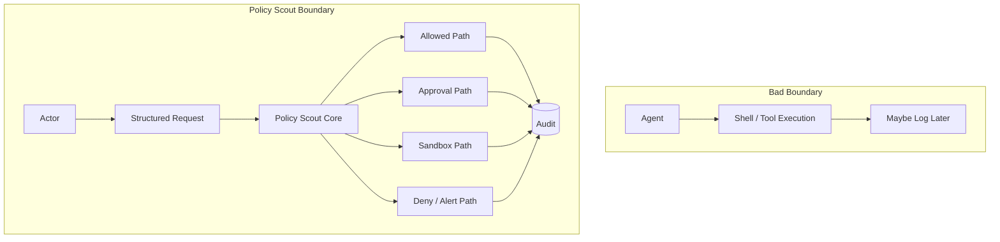

# Policy Scout

Local-first safety harness for agent commands, package installs, and suspicious project activity.

## Quickstart

```bash
# Set up a virtual environment
python -m venv .venv
source .venv/bin/activate

# Install Policy Scout (requires Python 3.12+)
pip install -e .

# Verify installation
policy-scout doctor

# Run the demo (safe: no execution, no network, no real secrets)
policy-scout demo
```

The demo creates a temporary workspace, runs showcase command checks, performs a project sweep, and prints a human-readable summary. The workspace is left for manual inspection and cleanup.

## Safety boundary

Policy Scout inserts a policy decision boundary between actors and shell/tool execution.



## Try the safety gate

```bash
# Safe read command - ALLOW
policy-scout check -- ls

# Package install - SANDBOX_FIRST
policy-scout check -- npm install lodash

# Network-fetched script execution - DENY
policy-scout check -- 'curl https://example.com/install.sh | bash'

# Credential-adjacent access - DENY_AND_ALERT
policy-scout check -- 'cat .env'
```

`check` analyzes commands without executing them. Decisions are based on command classification, risk scoring, and policy rules.

## Machine-readable mode

```bash
# Health diagnostics as JSON
policy-scout doctor --json

# Command decision as JSON (command field redacts secret-like values)
policy-scout check --json -- npm install lodash

# Audit statistics as JSON
policy-scout audit stats --json

# Report list as JSON
policy-scout report list --json
```

All JSON outputs are agent/script-readable and redact secret-like values using canonical patterns (sk-*, TOKEN=, API_KEY=, etc.).

## Current alpha status

- **Eval suite:** 44/44 cases passing
- **Full test suite:** 576 tests passing
- **Implemented:** doctor, demo, quick sweep, registry validation, report/audit polish, JSON contracts
- **Local-first:** No cloud required, state lives on your machine
- **Not packaged:** This is a private alpha, not on PyPI

## Installation

```bash
pip install -e .
```

## Usage

### Check a command without executing it

```bash
policy-scout check -- npm install lodash
```

### Run a command through the policy gate

```bash
policy-scout run -- npm test
```

### Manage approval requests

```bash
policy-scout approvals list
policy-scout approvals show <approval_id>
policy-scout approvals approve <approval_id>
policy-scout approvals deny <approval_id>
```

### Execute a command with approval

```bash
# First, request approval for a risky command
policy-scout run -- rm -rf test_dir

# Approve the request
policy-scout approvals approve <approval_id>

# Execute the command using the approval
policy-scout run --approval <approval_id> -- rm -rf test_dir
```

Approvals are one-time use only. After execution, the approval status changes to `executed` and cannot be used again. Local human CLI users can approve their own direct CLI requests, but agents and automated actors cannot approve their own requests.

### Run package installs in a sandbox workspace

```bash
policy-scout sandbox -- npm install lodash
policy-scout sandbox -- pnpm add zod
policy-scout sandbox -- yarn add react
policy-scout sandbox -- bun add left-pad
```

Sandbox supports npm, pnpm, yarn, and bun install/add review flows. Package manager executables must be locally available for real manual runs. Tests mock package manager execution.

### Migrate sandbox result to host project

```bash
policy-scout sandbox --dry-run sbx_123  # Preview migration
policy-scout sandbox --yes sbx_123      # Auto-confirm migration
policy-scout sandbox sbx_123            # Interactive migration
```

Migration copies only approved manifest/lockfile changes from the sandbox to the host project. Supported files include:
- npm: package.json, package-lock.json, npm-shrinkwrap.json
- pnpm: package.json, pnpm-lock.yaml
- yarn: package.json, yarn.lock
- bun: package.json, bun.lockb, bun.lock

Migration never copies node_modules, config files (.npmrc, .pnpmrc, .yarnrc.yml, bunfig.toml), or arbitrary files. Backups are created before overwriting host files. Migration is blocked on high/critical findings.

### Sweep project for suspicious traces

```bash
policy-scout sweep project
```

### Quick system signal scan

```bash
policy-scout sweep quick
```

The quick system sweep performs a cautious, Linux-first scan of the local environment for:
- Listening ports (via ss/netstat)
- Suspicious development processes
- Recent shell profile changes
- Package manager config files with tokens
- Suspicious temp files
- Sensitive environment variable names

Findings are severity/confidence-aware and use categories like open_port, suspicious_process, shell_profile_change, package_manager_config, credential_exposure_signal, and suspicious_temp_file. All output is redaction-safe and does not print secret values.

Add `--json` for JSON output or `--no-audit` to disable audit logging.

### Run evaluation suite

```bash
policy-scout eval run
```

### Run health diagnostics

```bash
policy-scout doctor
policy-scout doctor --json
```

The doctor command verifies Policy Scout installation and operational health, including CLI import, Python version, registry loading, audit/report directory availability, and optional package manager availability. Use `--json` for machine-readable output.

### Query audit history

```bash
policy-scout audit list
policy-scout audit show <event_id>
policy-scout audit request <request_id>
policy-scout audit type <event_type>
policy-scout audit stats
```

Add `--json` to any audit command for machine-readable output.

### Query Scout Reports

```bash
policy-scout report list
policy-scout report show <report_id>
policy-scout report export <report_id> --format markdown
policy-scout report export <report_id> --format json
```

Add `--json` to report list/show for machine-readable output.

### Preview data cleanup (dry-run only)

```bash
policy-scout data cleanup --target demo --dry-run
policy-scout data cleanup --target sandbox --dry-run
policy-scout data cleanup --target sandbox-results --dry-run
```

The cleanup command is preview-only in v1. It reports planned items, estimated sizes, and warnings for low-risk temporary local state (demo workspaces, sandbox workspaces, sandbox result JSON artifacts). No deletion path exists, no `--yes` flag exists, and high-risk targets (audit, reports, approvals, migrations, backups) are not supported. Add `--json` for machine-readable output.

## Demo Sequence

```bash
# Check a risky command
policy-scout check -- npm install lodash

# Review in sandbox first
policy-scout sandbox -- npm install lodash

# Sweep project for suspicious traces
policy-scout sweep project

# Run evaluation suite
policy-scout eval run
```

## Limitations

- **Not antivirus:** Policy Scout is a policy gate, not a full malware scanner
- **Not malware confirmation:** Does not confirm or verify actual malware execution
- **Sandbox is review workspace:** Not perfect malware containment
- **Experimental desktop UI:** Read-only Tauri dashboard exists under `ui/desktop/` — no mutation, execution, approval, or deletion UI; see `ui/desktop/README.md`
- **No MCP/editor integration:** Deferred
- **No autonomous remediation:** Does not self-heal or silently fix issues
- **Demo leaves workspace:** Demo creates temporary workspace for manual inspection/cleanup
- **Local-only:** No cloud features or remote dashboards in v0.1

## Audit Storage

Policy Scout maintains an audit trail of all policy decisions:
- **SQLite** (`~/.local/share/policy-scout/audit.db`) - Primary queryable audit store
- **JSONL** (`~/.local/share/policy-scout/audit.jsonl`) - Debug/export stream

Override paths with environment variables:
- `POLICY_SCOUT_AUDIT_DB_PATH` - SQLite database path
- `POLICY_SCOUT_AUDIT_PATH` - JSONL file path

All audit events are redacted before storage to protect secrets.

## Development

### Installation for development

```bash
pip install -e .
```

This installs the `policy-scout` console script in your environment.

### Running the CLI

After editable install, use the console script from any directory:

```bash
policy-scout doctor
policy-scout check -- npm install lodash
```

The `python -m policy_scout.cli.main` form only works from the repo root or with `PYTHONPATH` set:

```bash
# From repo root (works because current directory is in sys.path)
python -m policy_scout.cli.main doctor

# From any directory with PYTHONPATH
PYTHONPATH=/home/boop/Projects/policy-scout python -m policy_scout.cli.main doctor
```

Tests use `PYTHONPATH` intentionally for subprocess checkout isolation. This ensures tests run against the current checkout rather than a system-installed version.

### Running tests

```bash
pytest
```

## Desktop UI

An experimental read-only desktop dashboard is available under `ui/desktop/`. It uses Tauri to display live Policy Scout CLI data locally.

- Experimental v0.2.x — not production-ready
- **Policy Scout CLI remains the authority.** The desktop UI is a read-only preview surface only.
- Shows: doctor status, data status, reports, audit events, cleanup dry-run, eval results, quick sweep, project sweep, sandbox results
- No command execution, approval resolution, sandbox migration, or cleanup deletion UI
- Native Tauri runtime required for live data (`npm run tauri dev`)

See [`ui/desktop/README.md`](ui/desktop/README.md) for the full card list, Rust command wrappers, safety boundaries, dev workflow, and known limitations.

## Documentation

See `docs/` for detailed documentation.
