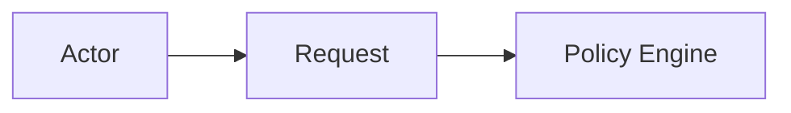
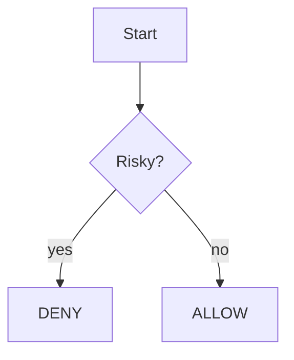

# Policy Scout — Diagram Rendering Guide

## 1. Purpose

This document explains how Policy Scout diagrams should be rendered, exported, and maintained.

The visual source of truth should start as text-based Mermaid diagrams and Markdown matrices. These can later be exported to SVG, PNG, PDF, slides, or polished design assets.

---

## 2. Rendering Doctrine

Diagrams should remain:

- version-control friendly
- readable by agents
- readable by humans
- easy to diff
- easy to update
- aligned with architecture docs

Start with Mermaid.

Polish later.

Do not begin with static images that are hard to revise.

---

## 3. Source Formats

Preferred source formats:

```text
Mermaid for flowcharts and system diagrams
Markdown tables for matrices
Markdown cards for scenario cards
JSON/YAML later for graph exports
```

Avoid making the first source of truth a screenshot or image.

---

## 4. Mermaid Rendering Targets

Mermaid diagrams can be rendered in:

```text
GitHub Markdown
GitLab Markdown
Obsidian
VS Code Markdown preview with Mermaid support
Mermaid Live Editor
Mermaid CLI
documentation generators
```

Possible export formats:

```text
SVG
PNG
PDF
```

SVG is preferred for polished docs because it stays crisp.

---

## 5. Recommended Export Workflow

Suggested workflow:

```text
1. Write Mermaid in MERMAID_DIAGRAMS.md.
2. Preview in Markdown viewer.
3. Fix syntax and labels.
4. Export to SVG.
5. Store exports in docs/assets/diagrams/.
6. Reference SVGs from README/docs.
7. Keep Mermaid source next to exported assets.
```

Suggested directory:

```text
docs/
  diagrams/
    MERMAID_DIAGRAMS.md
  assets/
    diagrams/
      system_architecture.svg
      safety_boundary.svg
      sandbox_flow.svg
```

---

## 6. Naming Exports

Use lowercase kebab case for exported diagrams.

Examples:

```text
system-architecture-map.svg
core-safety-boundary.svg
granular-evaluation-pipeline.svg
policy-decision-tree.svg
sandbox-install-flow.svg
sweep-engine-flow.svg
audit-reporting-flow.svg
approval-queue-flow.svg
risk-clutch-flow.svg
integration-boundary.svg
local-first-data-map.svg
cerebra-lumaweave-bridge.svg
```

---

## 7. Diagram Captions

Every rendered diagram should have a caption.

Caption format:

```text
Figure <n>. <Title>. <One-sentence purpose.>
```

Example:

```text
Figure 1. System Architecture Map. Shows how actor requests pass through Policy Scout classification, policy, execution, and audit layers.
```

---

## 8. Diagram Metadata

Each diagram source should include metadata in nearby Markdown.

Recommended fields:

```text
title
purpose
source docs
last updated
status
render target
```

Example:

```md
## System Architecture Map

Status: draft  
Source docs: ARCHITECTURE.md, DATA_MODELS.md  
Render target: SVG  
Purpose: Show the main Policy Scout runtime spine.
```

---

## 9. Mermaid Style Guidance

Keep labels short.

Good:

```text
Policy Engine
Risk Scorer
Audit Store
Scout Report
```

Avoid huge node labels.

Bad:

```text
This component evaluates all policies and decides whether the actor should be allowed to execute the command
```

Use docs for detail; diagrams for structure.

---

## 10. Mermaid Syntax Guidance

Use `flowchart LR` for left-to-right pipelines.

Use `flowchart TD` for decision trees.

Use `subgraph` for bounded systems.

Examples:





---

## 11. Accessibility Guidelines

Diagrams should not rely only on color.

Use:

- text labels
- clear node names
- meaningful arrows
- captions
- adjacent prose summary

For every diagram, provide a short text description.

---

## 12. Image Export Guidelines

When exporting to image:

- prefer SVG for docs
- use PNG for previews/social/README if needed
- avoid tiny text
- avoid overly dense diagrams
- split large diagrams into smaller ones
- keep aspect ratio friendly for docs and slides

Suggested dimensions for polished PNG:

```text
16:9 diagram: 1920x1080
README wide image: 1600x900
compact card: 1200x800
```

---

## 13. Slide and Presentation Use

For presentations, use simplified versions of diagrams.

Presentation diagrams should:

- reduce node count
- increase whitespace
- use larger text
- focus on one message
- avoid implementation details unless necessary

Example:

```text
Slide diagram:
Actor -> Policy Scout -> Allow / Sandbox / Deny -> Report
```

Technical docs can contain the detailed version.

---

## 14. LumaWeave Compatibility

Future graph exports should map Policy Scout concepts into nodes and edges.

Example nodes:

```text
Actor
CommandRequest
EvaluationPacket
PolicyDecision
AuditEvent
Finding
ScoutReport
SandboxResult
```

Example edges:

```text
REQUESTED
EVALUATED_BY
MATCHED_POLICY
ISSUED_DECISION
GENERATED_EVENT
GENERATED_REPORT
FOUND
```

LumaWeave visuals can show dynamic relationships, while Mermaid docs show static architecture.

---

## 15. Maintenance Rule

If a diagram conflicts with a source doc, fix the conflict.

Diagrams should not invent behavior.

Source docs define behavior.

Diagrams communicate behavior.

---

## 16. Rendering Doctrine

The diagrams are part of the architecture.

They are not decorative extras.

They should make the safety boundary easier to understand and harder to accidentally break.
