# Policy Scout — Mermaid Diagrams

## 1. System Architecture Map

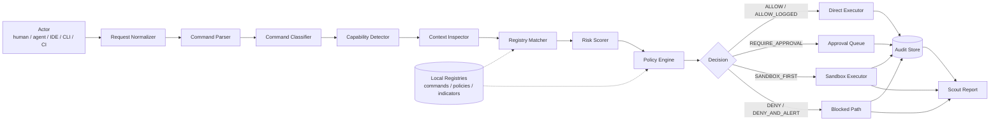

---

## 2. Core Safety Boundary

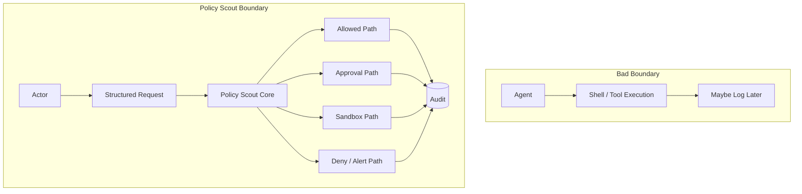

---

## 3. Granular Evaluation Pipeline

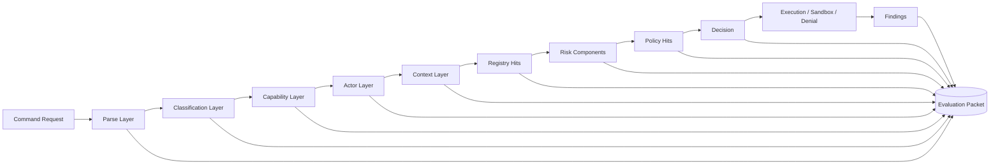

---

## 4. Policy Decision Tree

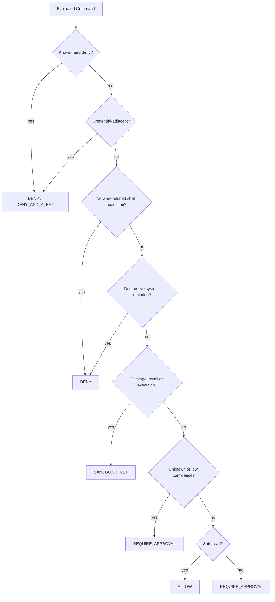

---

## 5. Sandbox Install Flow

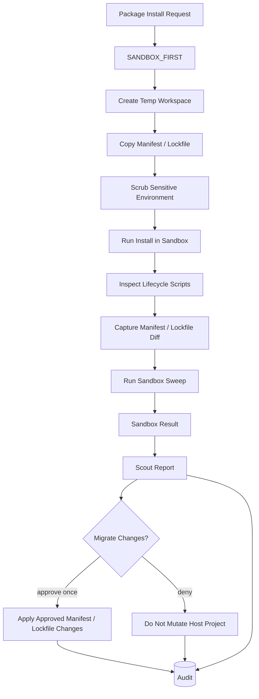

---

## 6. Sweep Engine Flow

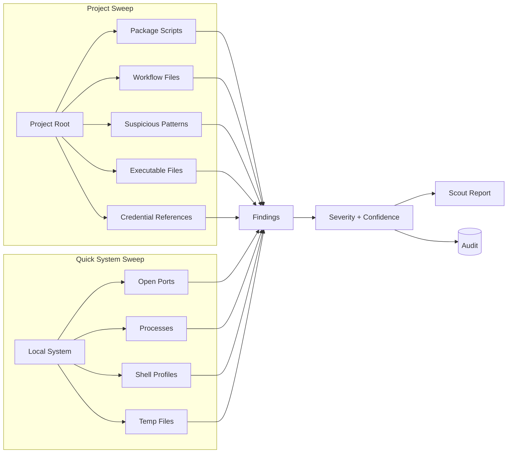

---

## 7. Audit and Reporting Flow

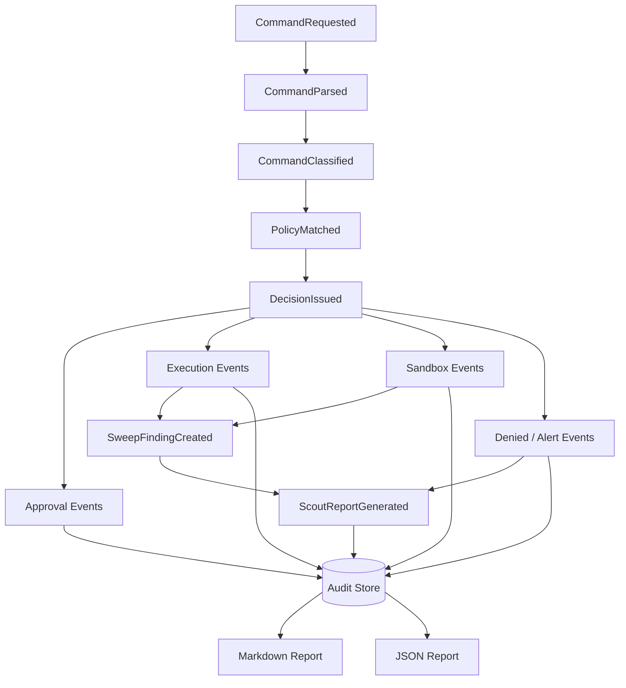

---

## 8. Approval Queue Flow

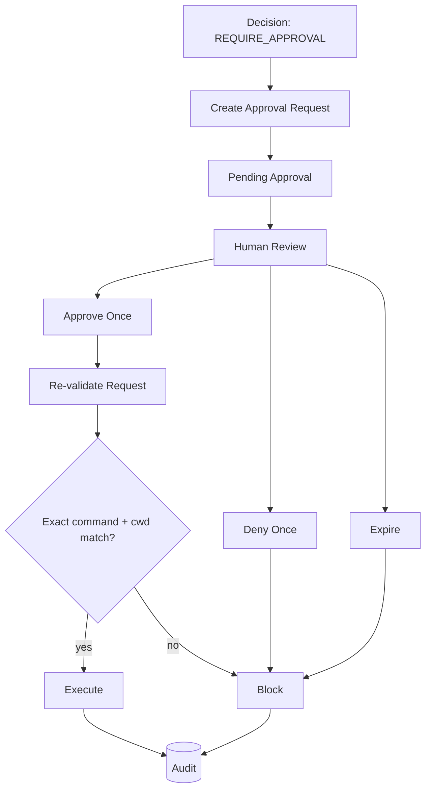

---

## 9. Risk and Clutch Flow

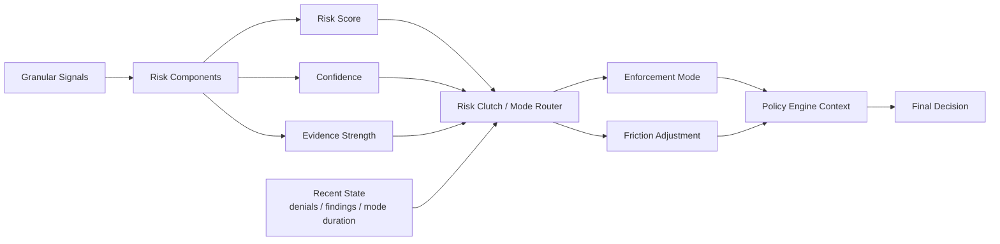

---

## 10. Integration Boundary

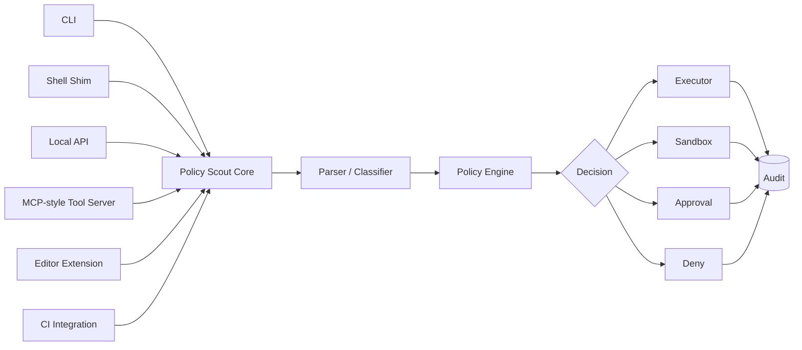

---

## 11. Local-First Data Map

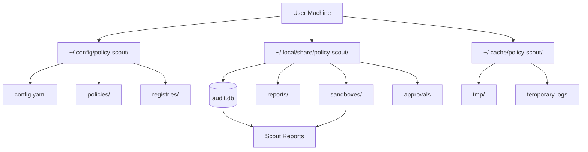

---

## 12. Cerebra / LumaWeave Bridge

```mermaid
flowchart LR
  scout[Policy Scout] --> events[Audit Events]
  scout --> reports[Scout Reports]
  scout --> findings[Findings]
  scout --> sandbox[Sandbox Results]

  events --> cerebra[Cerebra Memory Runtime]
  reports --> cerebra
  findings --> cerebra
  sandbox --> cerebra

  cerebra --> graph[Graph-ready Memory]
  graph --> luma[LumaWeave Visualization]

  luma --> view[Decision Graphs<br/>Incident Timelines<br/>Package Risk Maps]
```
